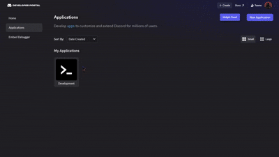

# Discord Widget Configurator (Portal Edition)

This UserScript injects an ambient, dark-themed layout configuration matrix directly into the native Discord Developer Portal UI. It allows developers to configure, export, import, and hot-reload advanced profile widget structures with single-click simplicity.



---

##   How to Use

1. **Open the Panel:** Navigate to the [Discord Developer Portal](https://discord.com/developers/applications). Click the **Widget Panel** button positioned next to the native "New Application" button.
2. **Load Your Apps:** Click **Query App Registry** to populate the dropdown menu with your existing Discord applications.
3. **Apply a Template:** Paste your target layout JSON scheme directly into the *Data Blueprint Object Repository* workspace buffer.
4. **Deploy:** Choose your target application from the dropdown and click **Import Structure** 

---

##   Compatibility & Built-On Source

This project is built directly on the foundation of **[Discord-Widgets-Extension v1.6.2](https://github.com/TheCreativeGod/Discord-Widgets-Extension/releases/tag/v1.6.2)**. 

Because it maintains absolute structural alignment with the original layout schema models, this version is fully compatible with and capable of running all JSON configurations and layout templates built for the original extension.

 **Need Help?** If you run into any setup failures or structural system issues, feel free to DM **[Shadow](https://discord.com/users/1065604516399026176)** directly on Discord.

---

##   Key Features

* **Native Interface Overlay:** Adds a dedicated **Widget Panel** button directly alongside the native *New Application* button inside the dashboard interface.
* **Ambient Design System:** Implements a custom dark-mode workspace utilizing Discord's core `gg sans` typography and smooth, custom scrollbar animations.
* **Data Blueprint Object Repository:** A fully functional sandbox area to manipulate, modify, copy, and serialize target widget JSON schematics.
* **Hot-Reload Architecture:** Clear and instantly swap state layout configuration arrays dynamically without cycling page states.
* **Unified Asset Compilation Management:** Automatically parses unique layout image items into memory buffers and packs them cleanly into deployment packages.
* **Elevated Terminal Shell Fallback:** Generates a real-time PowerShell pipeline command script to bypass authorization roadblocks or security integration sync boundaries instantly.
* **Feature Flag Injection:** Forced client configuration experiment flags onto memory registries to keep hidden tabs visible after continuous memory refreshes.

---

##   Dashboard Functions Documented

| Feature Trigger | System Action Behavior |
| :--- | :--- |
| **Run Full Setup** | Automatically provisions application endpoint setups, binds social presence layer keys, and locks instances onto global profile structures. |
| **Query App Registry** | Pulls active profile client IDs and downloads current identity lists cleanly into selective routing dropdown components. |
| **Export Structure** | Reassembles target active templates from active viewports and serializes them into complete, copyable JSON packages. |
| **Import Structure** | Validates structural inputs and patches matching configuration properties into newly established or active target frames. |
| **Hot-Reload Configuration**| Immediately forces production edits straight into edge CDN layers for instant updates. |
| **Enable Sidebar Tab** | Manual safety override mechanism to re-inject hidden experiment tabs back into left navigation panes. |

---

##   Installation

1. Ensure you have a userscript manager installed in your browser:
   * **Recommended ScriptVault for Chrome:** [Chrome Extension](https://chromewebstore.google.com/detail/scriptvault/jlhdbkeijcbgnonpfkfkkkhfmbeejkgh?hl=en)
   * **Recommended Violentmonkey for Firefox:** [Firefox Add-on](https://addons.mozilla.org/en-US/firefox/addon/violentmonkey/)
   * Alternatively, other managers like **Tampermonkey** or **User Scripts Manager** / **Magic Userscript+** / **User Script Loader** will also work.
2. Create a new script, copy the complete contents of `Discord_Widget_Configurator-UserScript.js`, and save it. (you can also donwloaded it dicrtly from Greasyfork: https://greasyfork.org/en/scripts/585129-discord-widget-configurator-portal-edition)
3. Navigate to your [Discord Developer Portal](https://discord.com/developers/applications) to interact with the new interface options.

---

## 📄 License & Attribution

This project is open-source software licensed under the **MIT License**.

```text
MIT License

Copyright (c) 2026 Adrian Beltran (TheCreativeGod)
Copyright (c) 2026 Shadow (ItzMeShadow999)

Permission is hereby granted, free of charge, to any person obtaining a copy
of this software and associated documentation files (the "Software"), to deal
in the Software without restriction, including without limitation the rights
to use, copy, modify, merge, publish, distribute, sublicense, and/or sell
copies of the Software, and to permit persons to whom the Software is
furnished to do so, subject to the following conditions:

The above copyright notice and this permission notice shall be included in all
copies or substantial portions of the Software.
